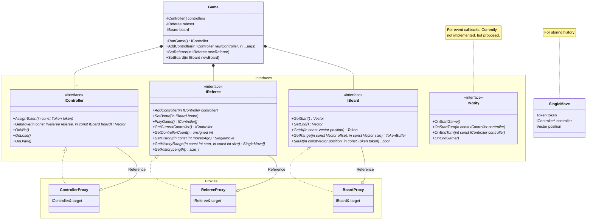
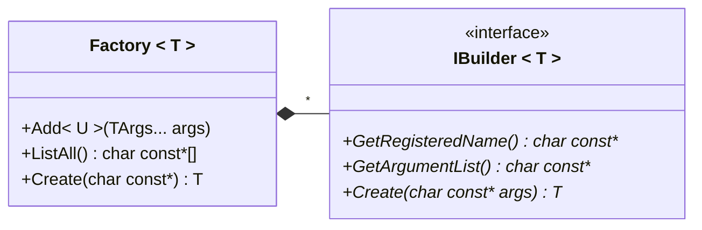
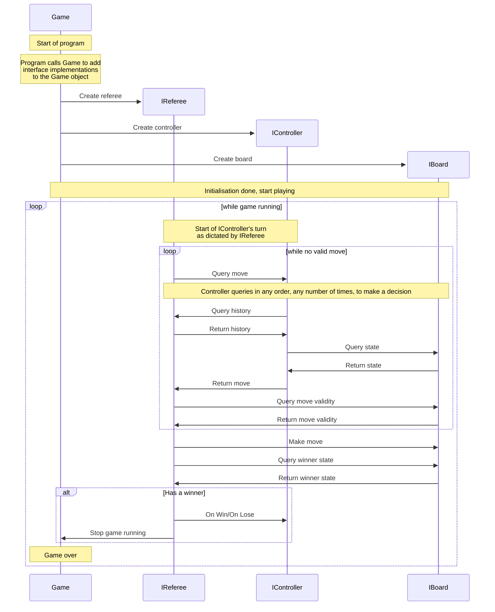

# Structure

## Class Diagram
The class structure is designed through interfaces to allow for implementers to create their own completely custom implementations of controllers, boards and even rulesets.

The `Game` object takes ownership of the interfaces passed in. By combining this with proxy interface implementations, we can allow for optional ownership of the true interface target without compromising on the ownership design.

`IController`
- `AssignToken` : Allows the controller to be aware of its token
- `GetMove` : Request to the controller to get the move it would make in this situation
- `OnWin` : Event callback to the controller when this controller win the game. Win conditions are determined by the referee
- `OnLose` : Event callback to the controller when this controller loses the game. Lose conditions are determined by the referee
- `OnDraw` : Event callback to the controller when the game ends in a draw. Draw conditions are determined by the referee

`IReferee`
- `AddController` : Passes a contoller to the referee. **Does not** transfer ownership of the controller to the referee
- `SetBoard` : Passes the board that the game is to be played on to the referee. **Does not** transfer owership of the board to the referee
- `PlayGame` : Run the game loop. Returns an array of IControllers that won back to the game
- `GetCurrentController` : Returns the current controller
- `GetControllerCount` : Returns the number of controller's currently registered
- `GetHistory` : Returns a single move at that point in history, counting backwards. A history index of `0` refers to the last move. History must track back far enough to include each controller's last move. An invalid history index returns a `0` token and a `nullptr` for controller (position is undefined)
- `GetHistoryRange` : Returns an array of moves from the history
- `GetHistorySize` : Returns the running size of the history object. May be variable with unusual rulesets

`IBoard`
- `GetStart` : Get the minimum position index
- `GetEnd` : Get the maximum position index
- `GetAt` : Get the token at a specified position. If the range is out of bounds, return `0`
- `GetRange` : Get a dense copy of the board in a given range of coordinates. If any parts of the passed in range are out of bounds, return an empty array.
- `SetAt` : Set the specified position to the token provided. If the position is out of bounds, return false

To facilitate dynamically switching controllers (and referees and boards), a factory object should be created. To maintain this as a library, the application will create the factory and attach all the available builders to it.

This is a justifiable use of templates, as each factory uses the same base logic, just with different types between them. This also ensures that each factory behaves the same way, simplifying the interface.

## Sequence Diagram

Note: Query-Return pairs in the diagram can be implemented as source calling a method on the target, but are flexible enough to be used with networking (e.g. GET requests).