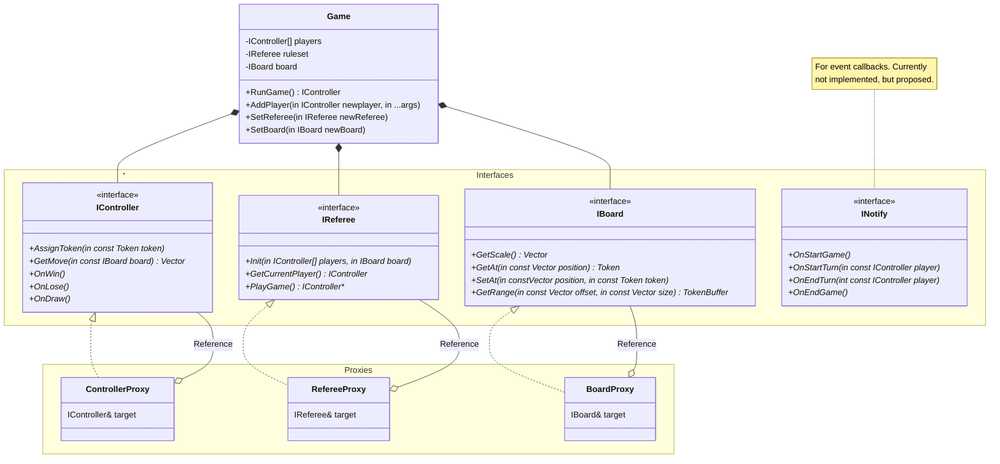
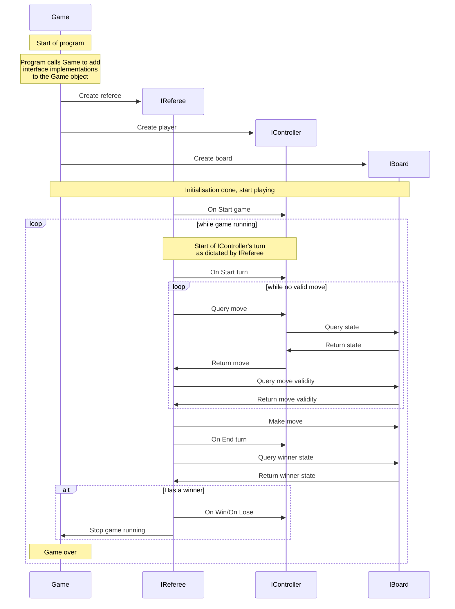

# Structure

## Class Diagram
The class structure is designed through interfaces to allow for implementers to create their own completely custom implementations of controllers, boards and even rulesets.

The `Game` object takes ownership of the interfaces passed in. By combining this with proxy interface implementations, we can allow for optional ownership of the true interface target without compromising on the ownership design.

## Sequence Diagram

Note: Query-Return pairs in the diagram can be implemented as source calling a method on the target, but are flexible enough to be used with networking (e.g. GET requests).